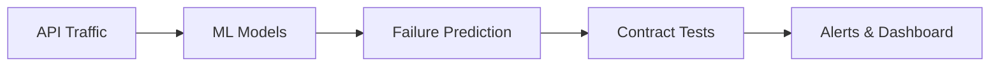

# `ApiCortex` Autonomous API Failure Prediction & Contract Testing Platform

  

## 1. Introduction
Modern software systems rely heavily on APIs across internal teams and third-party providers. API failures often occur due to upstream changes, traffic spikes, or undocumented dependencies, leading to production outages.

**ApiCortex** is an AI-powered API intelligence platform that predicts failures before they occur and continuously validates API contracts using real traffic patterns.

## 2. Problem Statement
- **Reactive Debugging:** API failures are often detected only *after* outages occur.
- **Incomplete Testing:** Manual contract testing fails to cover all edge cases.
- **Lack of Prediction:** No existing predictive monitoring for API health.
- **High Risk:** Microservice ecosystems face high operational risks due to complex dependencies.

## 3. Proposed Solution
We are building a cloud platform that:
- Monitors API traffic, latency, and error patterns in real-time.
- Learns "normal" API behavior using Machine Learning.
- Predicts the probability of future failures.
- Automatically generates and executes contract tests.
- Alerts teams with actionable, explainable insights.

## 4. Key Objectives
- **Prevent API-related outages** before they impact users.
- **Detect breaking changes** early in the development cycle.
- **Improve service reliability** across the entire stack.

## 5. Key Features

### i. API Telemetry Collection
- Real-time traffic monitoring.
- Granular latency and error metrics.

### ii. Behavioral Modeling
- ML models that learn and adapt to normal API usage patterns.

### iii. Failure Prediction Engine
- Advanced anomaly detection and risk scoring to foresee issues.

### iv. Contract Testing Automation
- Auto-generated tests based on observed real-world behavior, keeping contracts up-to-date automatically.

### v. Developer Dashboard
- Centralized view of API health scores.
- Failure predictions and trend analysis.
- comprehensive test results.

## 6. End-to-End Architecture

## 7. Real-World Use Case
*Scenario:* An upstream service commits a schema change.  
*Outcome:* ApiCortex predicts an upcoming API failure caused by this change and alerts the dependent teams **before** deployment, preventing a production incident.

## 8. Data Generation & Model Training

Due to the sensitive nature of production telemetry and the lack of publicly available real-world API failure datasets, all training data used in this repository is **synthetic**. We designed a custom generator (`DataGen/data.py`) that simulates 90 days of minute-level API observability metrics, including latency percentiles, error rates, traffic, schema changes, and deploy events. The generator uses:

- realistic daily/weekly traffic cycles with noise, spikes, crashes, and surges
- schema activity patterns with normal changes and occasional breaking updates
- latency and error models conditioned on load, deployments, and schema shifts
- a calibrated risk probability model to seed binary downtime labels with controlled prevalence
- edge-case datasets representing pure-normal and pure-downtime scenarios for validation

Parameters are tuned to produce data distributions that closely mirror expected production behaviors, giving the model the best chance to generalize when real telemetry becomes available.

The core predictive model is an XGBoost binary classifier trained on engineered features derived from past values (rolling means, variances, z‑scores, accelerations, etc.). Training follows a chronological 75/25 split with time‑series cross‑validation to avoid leakage. Threshold tuning prioritizes recall under a precision floor, reflecting the high cost of missed failures.

Final evaluation metrics on test data typically achieve:

- **F1‑score:** ~80-90 % (final for now: 82.44%)
- **Precision:** ~75-85 % (final for now: 79.79%)
- **Recall:** ~80-90 % (final for now: 85.28%)

These synthetic experiments offer a proof‑of‑concept; the pipeline and model are ready to ingest real traffic as it becomes accessible.

## 9. Contact
- **Email:** mail@0xarchit.is-a.dev
- **Contact Form:** https://0xarchit.is-a.dev/contact-us

---
This project delivers a developer-first reliability platform, reducing downtime in API-driven systems.